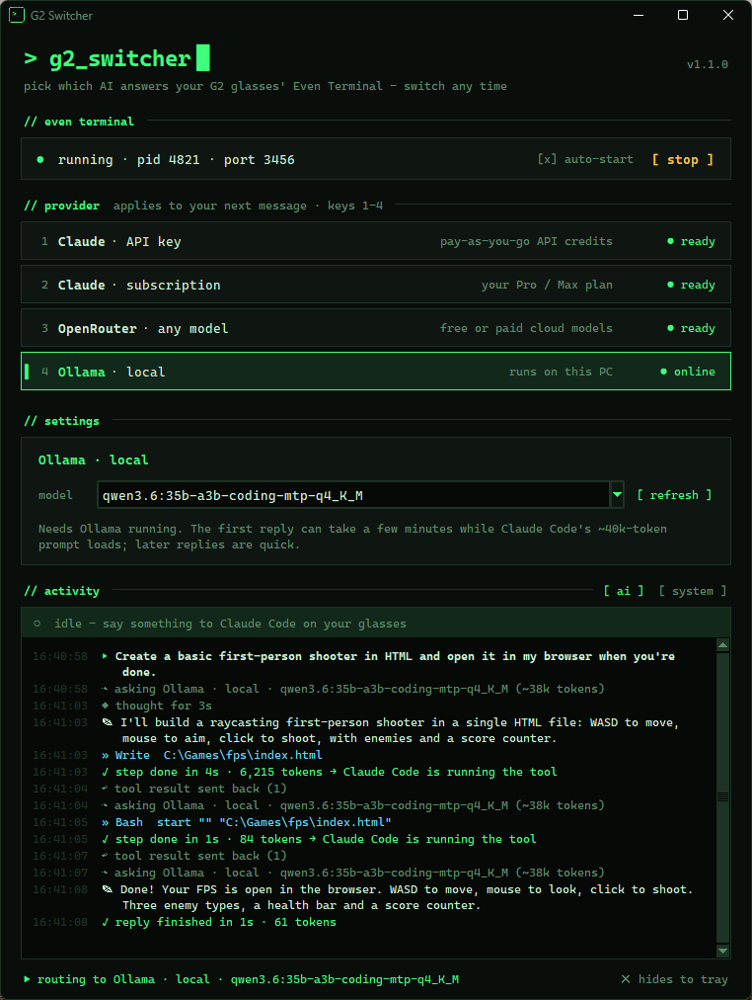
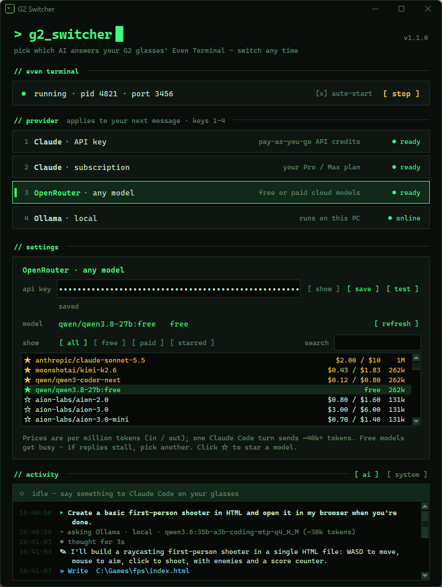
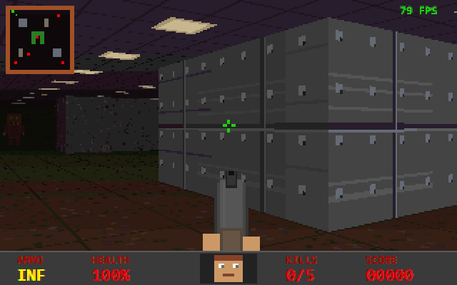

# G2 Switcher

A small Windows tray app that lets the **Even Realities G2** glasses' Terminal mode
talk to whichever AI you pick — and switch between them mid-conversation, no restart.

It's still **Claude Code** doing the work — file edits, terminal commands, permission
prompts on your glasses, MCP servers, skills — G2 Switcher only swaps the model behind it.
Pair it with a free OpenRouter model or a local Ollama model and you get the Claude Code
agent without paying for a model.

<p align="center">
  
  
</p>

**Built with it:** this little raycaster FPS was written start to finish by Claude Code
running on a local Qwen coder model (via Ollama on a 12 GB GPU), driven from the glasses.

<p align="center">
  
  <br><sub>Gameplay recorded with a small aim-bot script.</sub>
</p>

| Provider | What it uses |
|---|---|
| **Claude · API key** | Pay-as-you-go [Anthropic API](https://console.anthropic.com) credits |
| **Claude · subscription** | Your Claude Pro / Max plan, via a `claude setup-token` token |
| **OpenRouter · any model** | Any free or paid [OpenRouter](https://openrouter.ai) model that supports tool calling |
| **Ollama · local** | A model running on your own PC with [Ollama](https://ollama.com) |

## How it works

```
G2 glasses ─▶ Even Terminal ─▶ Claude Code ─▶ G2 Switcher relay (127.0.0.1:3457) ─▶ selected provider
```

G2 Switcher starts Even Terminal with Claude Code pointed at a local relay. Claude Code
only ever sees a placeholder token; the relay adds the real key for the provider you
selected. For non-Claude providers it also strips the Claude-only request fields
(extended thinking, context management, server tools, …) those APIs reject, and for
Ollama it creates a large-context copy of your model, because Claude Code's prompt
alone is ~40k tokens.

## Install

**Requirements:** Windows 10/11, [Node.js](https://nodejs.org), and Even Terminal
(`npm install -g @evenrealities/even-terminal`). Ollama only if you want local models.

**Easiest:** download `G2-Switcher.exe` from the
[latest release](https://github.com/Z-Gamez/G2-Switcher/releases/latest) and run it.
It's unsigned, so Windows SmartScreen may warn you the first time — choose
*More info → Run anyway*, or build it yourself below.

**Build it yourself** (needs Python 3.10+):

```bat
pip install -r requirements.txt pyinstaller
build.bat
powershell -ExecutionPolicy Bypass -File install.ps1
```

`install.ps1` copies `G2 Switcher.exe` to `%LOCALAPPDATA%\Programs\G2 Switcher` and adds
Start menu and desktop shortcuts. Open it, then right-click its taskbar icon → **Pin to taskbar**.

Or run from source: `pip install -r requirements.txt` then `pythonw app.py`.

## Use

1. Pick a provider (click it or press **1–4**).
2. Paste the key for it under **settings** and press **test**.
   - Claude subscription: run `claude setup-token` in a terminal and paste the `sk-ant-oat…` token.
   - OpenRouter: filter the model list by **all / free / paid / starred**, search it, and click
     ☆ (or right-click a model) to star favorites. Prices are per million tokens, in / out. Models
     without tool calling, or with a context window too small for Claude Code, are hidden.
3. Press **start** to launch Even Terminal, then open Terminal mode on your glasses.

### Activity

The **ai** tab shows what the model is doing while you wait on the glasses: what you asked,
thinking, the text it writes, each tool it calls (file writes, commands, …), and errors. The bar
above it is live: *waiting for the provider*, *thinking*, *writing*, *Claude Code is running a
tool* — with a timer, and a hint if a provider has been silent for a while. The **system** tab
has G2 Switcher's and Even Terminal's own log.

### Auto-compact

Claude Code thinks it's always talking to Claude, with a context window of up to 1M tokens,
so on its own it never compacts for a 64k local model — long runs would just stop with
"prompt is too long". With **auto-compact** on (the default), the relay asks Claude Code to
compact shortly before the real limit: ~12k tokens before Ollama's 64k, or near the limit of
the OpenRouter model you picked. Claude Code summarizes the conversation and carries on, even
in the middle of a multi-step task. If one huge tool output overshoots the limit, the relay trims
old tool outputs in the summary request so it still fits.

The Claude providers are never touched — they keep Claude Code's normal behavior. Switching
provider switches this instantly; nothing restarts.

The **context meter** on the right of the activity bar shows how full the window is
(e.g. `▰▰▰▰▰▰▱▱▱▱ 41k / 64k`), turning amber as it nears the compaction point.

### Local context size

Pick Ollama's context window from presets — **64k / 96k / 128k / 192k / 256k** (sizes above
what the selected model supports are greyed out). Bigger windows mean longer runs between
compactions but use more memory and make the first reply slower. Changing it takes effect on
the next message (the model reloads). Models with mostly linear attention, like the Qwen 3.6
MoE coders, need surprisingly little extra memory for big windows.

### Tray, login and updates

Closing the window keeps G2 Switcher in the system tray — right-click the tray icon to
switch providers, start/stop Even Terminal, or quit. Launching it again just brings the
window back.

- **start Even Terminal with the app** — no need to press start.
- **launch at Windows login (in tray)** — starts hidden in the tray when you sign in, so with
  the option above, Terminal is ready whenever you put the glasses on.
- When a newer release is out, an **update available** link appears in the header.

## Where things are stored

| What | Where |
|---|---|
| API keys / tokens | `%USERPROFILE%\.even-terminal\anthropic.key`, `claude-subscription.token`, `openrouter.key` |
| Settings | `%LOCALAPPDATA%\G2Switcher\settings.json` |
| Even Terminal logs | `%LOCALAPPDATA%\G2Switcher\logs\` |

Keys are plain text files readable by your Windows user account — the same way
Even Terminal and Claude Code store their own credentials. Nothing is sent anywhere
except to the provider you select.

## Troubleshooting

- **"Your credit balance is too low"** with credits on your account — the key belongs to a
  different organization than the credits. Check each organization's *Billing* page in the
  Anthropic Console and create the key in the one with the balance. (claude.ai "extra usage"
  is for subscriptions and doesn't fund API keys.)
- **OpenRouter errors like "overloaded" or "Upstream idle timeout"** — free models are shared
  and get busy. Pick a different `:free` model.
- **Ollama's first reply is slow** — the first turn has to process Claude Code's whole prompt;
  later turns are fast.
- **"another copy is running"** — an Even Terminal not started by G2 Switcher is using the port.
  Press start and G2 Switcher will offer to replace it.

## Development

`G2_SWITCHER_PORT=3499 python app.py` runs a second copy on another relay port.

Releases are built by GitHub Actions (`.github/workflows/release.yml`) when a `v*` tag is
pushed. The workflow code-signs the exe through [SignPath](https://signpath.org)'s free
open-source program once its secrets are configured; until then releases are unsigned.

| File | Purpose |
|---|---|
| `app.py` | Tkinter UI and tray icon |
| `backend.py` | Settings, keys, key tests, Even Terminal process |
| `relay.py` | The local Anthropic-API relay |
| `activity.py` | Reads the relayed traffic into the AI activity feed |
| `theme.py` | Colors, fonts, app icon (`python theme.py` writes `g2switcher.ico`) |

Not affiliated with Even Realities or Anthropic.

## License

MIT
